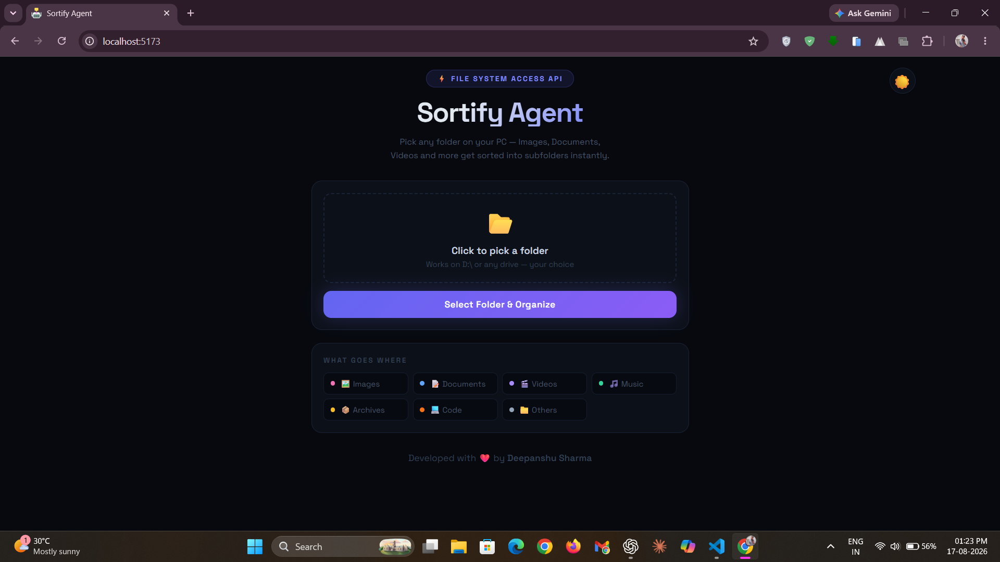
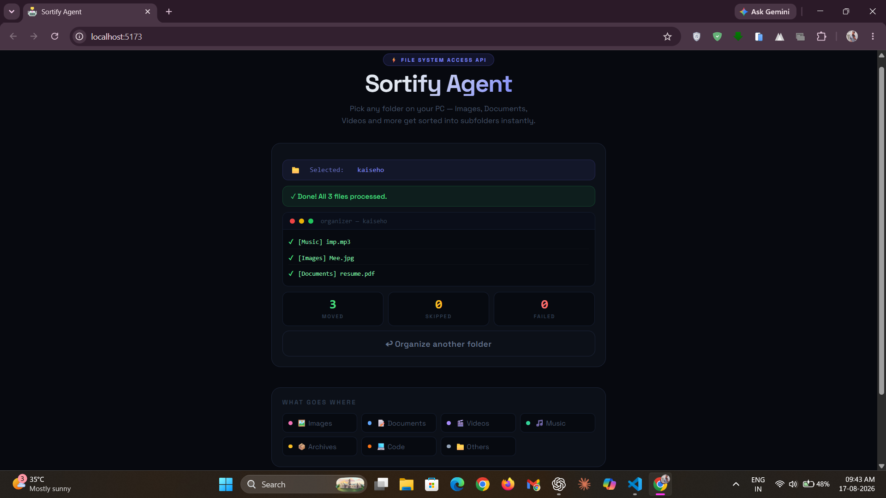
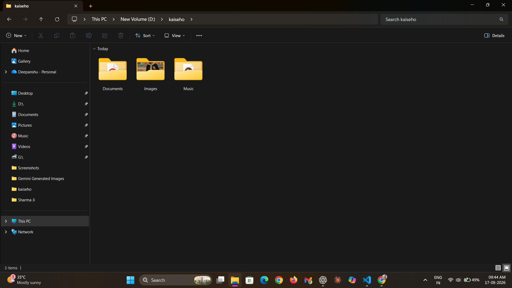

# SortifyAgent 🗂️


<br>


> Instantly organize your messy folders, no manual sorting, no installs.

## Description

SortifyAgent is a browser-based file organizer that sorts files from any local folder into categorized subfolders automatically. It uses the `File System Access API` to read and write directly to your file system — no backend, no uploads, no data leaves your machine.

Simply pick a folder, and SortifyAgent moves files into `Images`, `Documents`, `Videos`, `Music`, `Archives`, `Code`, and `Others` - all in real time.

> ⚠️ Designed for **PC/Desktop** only. Requires **Chrome** or **Edge** — Firefox does not support the <br> 
`File System Access API`.

## ✨ Features / Highlights

- 📂 **Direct File System Access:** Uses the native `showDirectoryPicker()` API to read/write local folders without any uploads.
- 🧠 **Smart Categorization:** Automatically detects file type by extension and routes to the correct subfolder.
- ⚡ **Real-time Processing:** Live terminal-style log shows every file move as it happens.
- 📊 **Progress Tracking:** Progress bar + stats counter for `moved`, `skipped`, and `failed` files.
- 🔒 **100% Local:** No server, no cloud, no data collection. Everything runs in your browser.
- 🎨 **Clean Dark UI:** Minimal, responsive dark interface built with custom CSS.

## 🖼️ Screenshots / Demo

> Take a look at some screenshots of the application below.

### 🏠 Landing Page

*Folder picker UI with category reference guide.*

### ⚙️ Processing

*Live terminal log showing real-time file sorting progress.*

### 📊 Output

*Final stats showing total files moved, skipped, and failed.*

## 🛠️ Tech Stack Used

- 🖥️ **Frontend:** React
- ⚙️ **Bundler:** Vite
- 🎨 **Styling:** Custom CSS-in-JS
- 📦 **API:** File System Access API (Chrome/Edge)
- 🔀 **Version Control:** Git & GitHub
- 🚀 **Deployment:** Vercel

## ⚙️ Setup & Installation

### 1️⃣ Clone the repository 
```bash
git clone https://github.com/DeepanshuSharma/SortifyAgent.git
```

#### 2️⃣ Navigate to the project directory 
```bash
cd SortifyAgent
```

### 3️⃣ Install dependencies 

> Make sure you have `Node.js` installed.

```bash
npm install
```

### 4️⃣ Start the application
```bash
npm run dev
```

### 5️⃣ Open the local URL shown in the terminal — use `Chrome` or `Edge`
```bash
http://localhost:5173
```

> No more file clutter. Let `SortifyAgent` organize it for you. 🔥